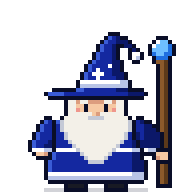
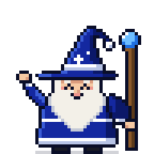
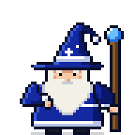
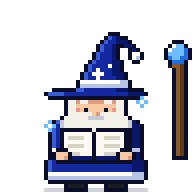
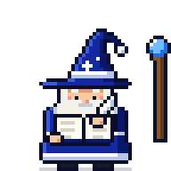
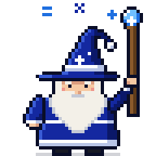
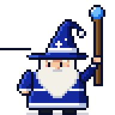
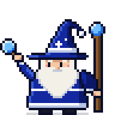
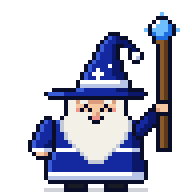

# Wizard brand: logo and character

The owner's ask (9 October 2026): Wizard is being productised and gamified. It needed a logo, a sprite, and the
wizard as a character that animates while Wizard works. He wears Samsung colours: Samsung Blue `#1428A0`, white and
black. Only the colours are used, never Samsung's logo or wordmark.

Everything here is drawn by [`scripts/wizard_art.py`](../scripts/wizard_art.py) from text grids, one character per
pixel. Do not edit the PNG or SVG files by hand: change a grid in the script, then run

```bash
python scripts/wizard_art.py           # redraw brand/ and the web app's copies
python scripts/wizard_art.py --check   # what CI runs (tests/unit/test_wizard_art.py): fails if a file is stale
python scripts/wizard_art.py --preview OUT_DIR   # big contact sheets of every frame and the logo, to look them over
```

It needs only the Python standard library, so it runs on a work PC too.

## Logo

| | File | Use |
|---|---|---|
|  | `logo/wizard-logo.svg`, `logo/wizard-logo.png` | Mark and pixel wordmark, on white or light backgrounds |
|  | `logo/wizard-logo-white.svg` | On Samsung Blue or dark backgrounds |
|  | `logo/wizard-mark.svg`, `logo/wizard-mark.png` | The mark alone: favicon, sidebar, answer cards |
|  | `logo/wizard-app-icon.svg`, `-32.png`, `-180.png`, `-512.png` | App icon: the reversed hat on a Samsung Blue tile |

- The mark is the wizard's own hat on a 16-pixel grid, so it stays sharp as a 16 or 32 pixel favicon.
- Scale pixel art by whole numbers only (2x, 3x, 4x). Never smooth it: use `image-rendering: pixelated` for PNGs.
  The SVGs carry `shape-rendering="crispEdges"`.
- Keep clear space around the logo of at least half the mark's height.

## Colours

| Role | Hex |
|---|---|
| Samsung Blue: robe, hat | `#1428A0` |
| Blue shadow | `#0B1869` |
| Blue light | `#3A5CD6` |
| White: trim, band, stars | `#FFFFFF` |
| Trim shadow | `#B8C4E6` |
| Outline (near black) | `#0A0E28` |
| Orb, sparkles (sky blue) | `#6EBEFF`, shadow `#1F6FE0` |
| A passed check | `#34C759` |

The full palette, by grid character, is in [`sprite/wizard-sprite.json`](sprite/wizard-sprite.json).

## The sprite sheet

`sprite/wizard-sprite.png`: 48 x 48 pixel frames, one row per animation, up to 8 frames per row (`wizard-sprite@4x.png`
is the same sheet at 4x). `sprite/wizard-sprite.json` gives each animation's row, frame count, frame rectangles, frames
per second and whether it loops, ready for a game engine.

| Animation | Preview | Frames · fps | When Wizard shows it |
|---|---|---|---|
| `idle` |  | 6 · 6, loops | At rest: the sign-in and loading screens |
| `wave` |  | 6 · 8, loops | Hello, on the start screen, then `idle` |
| `think` |  | 6 · 6, loops | Gemini is deciding the next step: no tool running, no text yet |
| `search` |  | 6 · 7, loops | A search tool runs: search reports, report schema, list sources, search catalog, browse knowledge |
| `read` |  | 6 · 6, loops | A read tool runs: run report, query PostgreSQL, read or query an attachment, read knowledge, look up definitions |
| `write` |  | 6 · 6, loops | Text is streaming in |
| `cast` |  | 6 · 8, loops | `wizard_calculate` runs |
| `chart` |  | 6 · 6, loops | `wizard_render_visual` runs |
| `check` |  | 6 · 6, loops | Check my data runs |
| `success` |  | 8 · 10, once | The run finished with an answer |
| `fail` |  | 6 · 7, once | The run failed |

The previews are animated PNGs at 4x. They loop, and a one-shot animation pauses on its last frame.

## In the web app

- `apps/web/src/components/WizardSprite.tsx`: `WizardSprite` plays one animation with CSS `steps()`. With reduced motion
  it holds the first frame. `WizardStage` is the strip at the top of a running answer: the wizard, what he is doing and
  the step he is on. It stays in view while the answer streams. It hops (`success`) or fizzles (`fail`) for a moment
  when a run ends live, then goes. A run reopened from history has no stage.
- `apps/web/src/wizard.ts` picks the animation from the run's observed events only: the running tool, streaming text, or
  the end state. The wizard never acts out a step Wizard did not take (AGENTS.md: show what Gemini actually did).
- `apps/web/src/wizardSheet.ts` (frame size and animation table), `apps/web/src/assets/wizard-sprite.png`,
  `wizard-mark.svg`, `wizard-logo.svg` and the favicon in `apps/web/index.html` are written by the script.
- Where he appears: the start screen (waves, then rests), sign-in (logo and the wizard at rest), the loading screen,
  the sidebar and each answer card (the mark), and the stage on a running answer.
