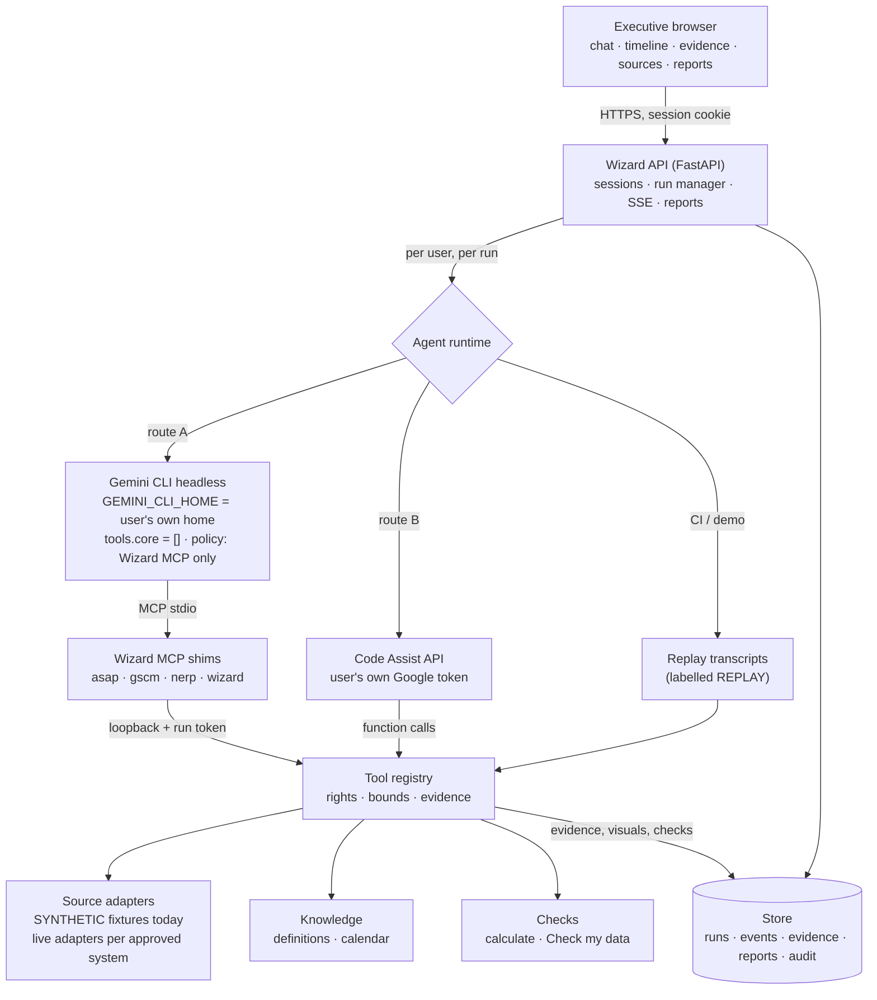

# Architecture

Wizard is agent-first: Gemini plans and performs the analysis; Wizard owns identity, tool boundaries, evidence,
streaming, checks and reports. The browser talks only to Wizard.

## Request lifecycle

1. The browser posts a question (`POST /api/v1/runs`). The run manager creates a run, enforces one active run per user
   and a global concurrency cap, and issues a **run token** (HMAC, scoped to that run and user, short-lived).
2. The chosen runtime starts under the user's own Gemini identity:
   - **gemini-cli**: `node gemini.js --output-format stream-json --model gemini-3.8-flash --policy <home>/wizard-policy.toml`
     with the prompt on stdin, `GEMINI_CLI_HOME=<user home>`, `GEMINI_FORCE_FILE_STORAGE=true` and
     `GEMINI_SYSTEM_MD=<Wizard system prompt>`. The CLI starts four MCP stdio shims, one per scope.
   - **code-assist**: an in-process loop of `streamGenerateContent` calls with the user's refreshed access token; function
     calls go straight to the registry.
3. Gemini decides each step. Every tool call reaches the **registry**, which validates arguments against a closed schema,
   checks the user's report and market rights, enforces row/time bounds, records **evidence** (request, columns, rows,
   as-of, digest, data mode) and returns data marked as untrusted source text.
4. Every observed action is persisted as a **run event** and streamed over SSE: model text, Gemini's interim notes,
   `tool_started`/`tool_finished` with evidence ids, visuals, check results, warnings, failures. Nothing is invented.
5. On finish the run manager assembles a **dated report**: answer, visuals, cited and created evidence, runtime and model,
   data mode (weakest of the evidence), check status, warnings (e.g. a citation to evidence that does not exist).
6. Reopening a report re-checks the viewer's *current* rights to every cited source and market.

## Boundaries

| Boundary | Enforcement |
|---|---|
| User identity | Fixture identities (dev) or a trusted SSO proxy header from allowlisted proxy IPs; HMAC-signed, HttpOnly, SameSite=Strict session cookie; state changes require `X-Wizard-Request` and same origin |
| Gemini identity | Per-user `GEMINI_CLI_HOME` + forced file credential storage (route A) or per-user refresh token in DPAPI (route B); no fallback to any other login; linking refuses a Google email that differs from the Wizard user |
| Tools | Read-only registry only; closed JSON schemas; no shell/files/web (CLI `tools.core = []`), policy allows only Wizard MCP servers; per-run tool-call budget |
| Internal tool API | Loopback-only, run token bound to an *active* run of the same user; a scope check stops a shim calling another scope's tools |
| Source data | Rights checked on search, schema, run, drill-down and report reopen; market rows filtered with an explicit access note; missing rows reported as missing |
| Untrusted text | Tool results carry an explicit "data, not instructions" policy; the CLI also wraps MCP output in `<untrusted_context>`; injected requests for non-existent tools fail closed |
| Browser | Strict CSP, no raw HTML from model output, external links `noopener noreferrer`, no credentials in responses |

## Components

- `services/api/wizard_api` — `app.py` (routes, middleware), `runs.py` (run manager, recorder, bridge, report assembly),
  `store.py` (SQLite schema v1), `security.py` (tokens, headers), `config.py`.
- `services/agent/wizard_agent` — `gemini_cli.py`, `stream_json.py`, `code_assist.py`, `google_oauth.py`, `secret_box.py`,
  `replay.py`, `prompting.py`, `prompts/system.md`.
- `services/connectors/wizard_connectors` — `catalog.py`, `entitlements.py`, `fixture_source.py`, `tools/`, `mcp_shim.py`,
  `asap_library.py`, `knowledge.py`.
- `services/checks/wizard_checks` — `calc.py`, `checker.py`.
- `apps/web` — `App.tsx`, `runState.ts` (event reducer shared by live and stored runs), components.

## What is deliberately absent

An intent router, a fixed tool order, a mandatory verifier, a deterministic ranking engine, write or export tools,
browser-cookie connectors, and any shared Gemini login. See [AGENTS.md](../AGENTS.md).
