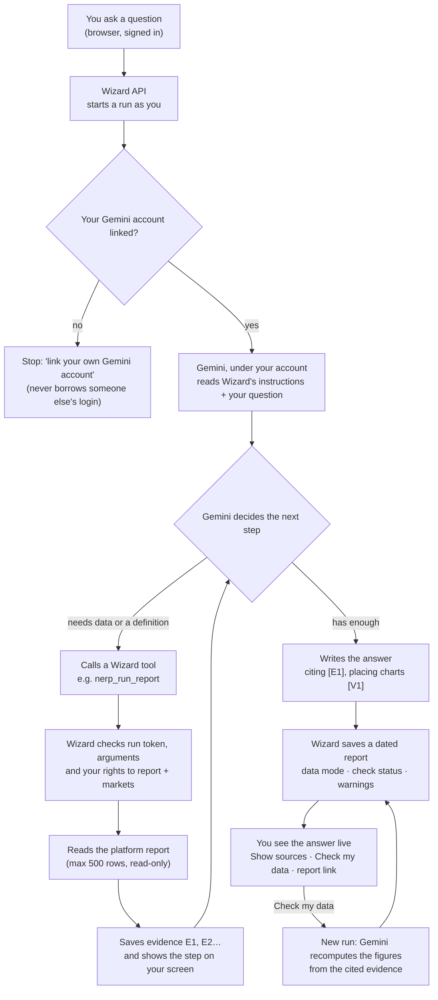
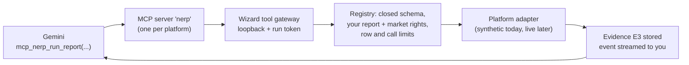

# How Wizard works

## One question, end to end

## Inside one tool call

## Where Gemini runs

- **gemini-cli route:** Wizard starts the Gemini CLI for each question inside your own folder (your sign-in only), with
  no built-in tools, so it can use only Wizard's read-only tools.
- **code-assist route:** Wizard calls the same Code Assist API the CLI uses, with your own Google token.
- **replay:** recorded answers over synthetic data for tests and demos, always labelled REPLAY.

The Step 02 spike on the work PC decides between the first two.
